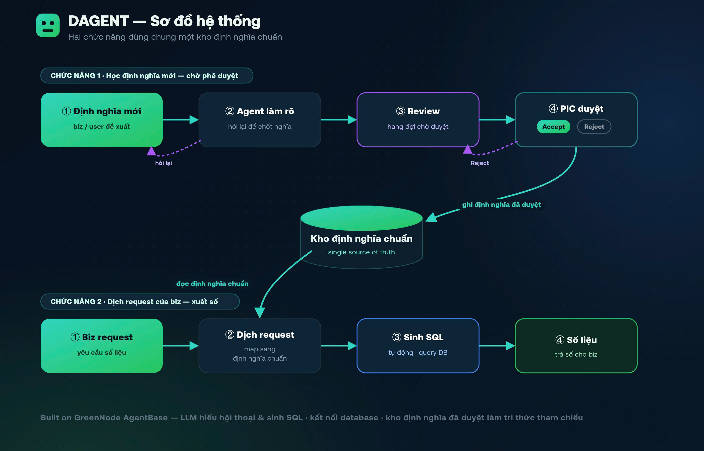

# DAGENT - Data Agent cho Doanh Nghiệp

## Vấn đề

Các phòng ban trong công ty luôn tốn thời gian nhiều giờ khi cần dữ liệu bởi 3 nút thắt dữ liệu:

- **Đứt gãy tri thức:** Chỉ số cốt lõi được hiểu theo nhiều kiểu khác nhau. Tri thức bị khóa trong đầu vài cá nhân khiến người mới chật vật làm quen (onboarding), còn người cũ tốn thời gian giải thích lặp đi lặp lại.
- **Mâu thuẫn số liệu:** Thiếu một "từ điển" chuẩn dẫn đến những cuộc họp vô bổ chỉ để tranh cãi "số của ai mới đúng" hoặc các hiểu và lấy số đang không giống với nhau.
- **Nút thắt truy xuất:** Business chờ 1-3 ngày để được Data team hỗ trợ SQL và lấy data, nhưng kết quả đôi khi không đủ để quyết định do câu hỏi ban đầu chưa được "nắn" chuẩn.

## Người dùng mục tiêu

- **Khối Business (Sales, Marketing, Ops, Lãnh đạo):** Cần hiểu đúng định nghĩa thuật ngữ và lấy số nhanh để ra quyết định.
- **Khối Data/Finance:** Muốn tập trung phân tích chuyên sâu, thoát khỏi vòng lặp đi giải thích số liệu và viết SQL hộ.

## Cách Agent giải quyết

- **Input:** Yêu cầu số liệu hoặc tra cứu định nghĩa bằng ngôn ngữ tự nhiên.
- **Xử lý:** Xây dựng trên **GreenNode AgentBase**, DAGENT hoạt động như một BI Senior đã thấm ngôn ngữ team bạn. Dùng LLM hiểu hội thoại, nó không vội vã lấy số ngay. Agent nhận diện các term mơ hồ từ kho Data Dictionary, chủ động hỏi lại những gì còn thiếu, đảm bảo câu hỏi chuẩn xác trước khi xuất SQL. Khi gặp định nghĩa/cách dùng mới, agent làm rõ rồi đẩy vào hàng đợi Review; PIC bấm Accept/Reject để chốt nguồn chuẩn duy nhất. Tri thức mới lập tức được lưu trữ - không để cùng một câu phải giải thích hai lần.
- **Output:** Số liệu, biểu đồ tức thì kèm phần giải nghĩa thuật ngữ rành mạch.

## Giá trị mang lại

DAGENT giúp Business tự lấy số trong vài giây, loại bỏ độ trễ và triệt tiêu mâu thuẫn do "mỗi người một định nghĩa". Hơn thế, công cụ là "bộ não" tự động lưu trữ và phát triển *knowledge domain* (tri thức miễn phí). Sẵn sàng scale-up cho mọi phòng ban, DAGENT giúp đồng bộ ngôn ngữ dữ liệu trên quy mô toàn công ty.

## Sơ đồ hệ thống

