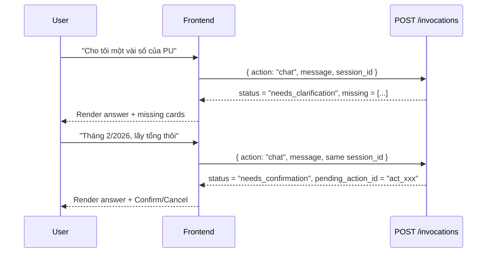
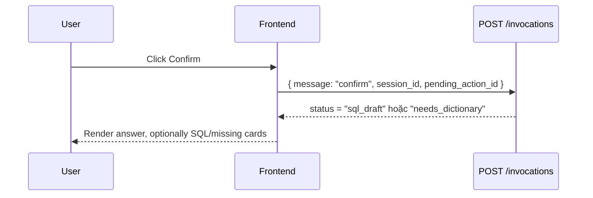

# Frontend API Contract

Tài liệu này là contract để FE tích hợp Chat UI với agent. Runtime vẫn dùng một endpoint duy nhất của AgentBase: `POST /invocations`. FE không cần gọi endpoint riêng như `/chat`.

## 1. Base API

Local:

```text
http://127.0.0.1:8080
```

Production:

```text
https://<agent-runtime-host>
```

Health check:

```http
GET /health
```

Invocation:

```http
POST /invocations
Content-Type: application/json
```

## 2. Response Envelope

Mọi response từ `/invocations` đều được bọc bởi envelope này.

```ts
interface AgentApiResponse<T> {
  status: "success" | "error";
  timestamp: string;
  request_id?: string;
  session_id: string | null;
  result?: T;
  error?: {
    code: string;
    message: string;
    details?: unknown;
  };
}
```

Ý nghĩa field:

| Field | Type | FE dùng để làm gì |
| --- | --- | --- |
| `status` | `"success" \| "error"` | Check request thành công hay lỗi. Nếu `error`, chỉ render `error.message`. |
| `timestamp` | `string` | ISO timestamp từ backend, dùng cho log/debug. |
| `request_id` | `string?` | Correlation id nếu FE truyền lên hoặc runtime sinh ra. |
| `session_id` | `string \| null` | Session id ở envelope; với chat nên ưu tiên `result.chat_session_id`. |
| `result` | `T?` | Payload chính khi `status = "success"`. |
| `error` | `object?` | Thông tin lỗi chuẩn khi `status = "error"`. |

FE rule:

```ts
if (response.status === "error") {
  showError(response.error?.message ?? "Có lỗi xảy ra");
  return;
}
```

## 3. Public Actions Cho FE

| Action | Public | Mục đích |
| --- | --- | --- |
| `chat` | Có | Chat chính, follow-up, confirm/cancel, teaching qua chat. |
| `search_knowledge` | Có, optional | Search panel hoặc source lookup. |
| `storage_status` | Có, diagnostics | Kiểm tra backend đang dùng JSON/Postgres/Supabase. |

Các action admin khác không cần dùng trong Chat UI phase này.

## 4. Backend Refactor & Fast-Path Compatibility

Backend hiện đã tách phần nội bộ ra `agent_core/*`, nhưng FE contract không đổi:

- FE vẫn chỉ gọi `POST /invocations`.
- Request/response envelope vẫn giữ nguyên.
- Chat UI vẫn dựa vào `ChatRequest`, `ChatResult`, `requires_confirmation`, `pending_action_id`, `missing`, `sql`.
- FE không phụ thuộc tên module backend như `knowledge_store.py` hay `agent_core/*`.

Fast-path là tối ưu backend dự kiến cho các câu follow-up rõ ràng trong session, ví dụ: "cần breakdown gì không?", "thiếu gì nữa không?", "đã đủ rõ chưa?". Khi fast-path được implement, mục tiêu là giảm latency bằng cách bỏ qua một số bước planner nặng. Contract FE vẫn nên giữ ổn định:

- FE vẫn gửi action `chat` như hiện tại.
- FE vẫn render `result.answer`.
- FE vẫn quyết định UI bằng structured fields.
- Nếu backend thêm `intent` mới như `pending_data_query_advice`, FE có thể coi như intent optional và không cần logic riêng.

## 5. Chat Request

```ts
interface ChatRequest {
  action?: "chat";
  message: string;
  user_id?: string;
  session_id?: string;
  pending_action_id?: string;
  debug_context?: boolean;
  use_runtime_skills?: boolean;
  request_id?: string;
}
```

Ý nghĩa field:

| Field | Required | Ý nghĩa |
| --- | --- | --- |
| `action` | Không | Nên gửi `"chat"`. Nếu omit nhưng có `message`, backend vẫn route về chat để tương thích payload cũ. |
| `message` | Có | Nội dung user nhập hoặc command `"confirm"` / `"cancel"`. |
| `user_id` | Nên có | Id người dùng để memory/session ổn định. |
| `session_id` | Nên có | Id cuộc chat. FE nên giữ cố định trong một conversation. |
| `pending_action_id` | Khi confirm/cancel | Id action đang chờ xác nhận, lấy từ `result.pending_action_id`. |
| `debug_context` | Không | `true` để backend trả thêm knowledge/dictionary/examples/debug. Không bật mặc định ở production UI. |
| `use_runtime_skills` | Không | `false` để tắt runtime skill cho request đó. Mặc định để backend tự chọn. |
| `request_id` | Không | Id do FE sinh để trace request end-to-end. |

Chat thường:

```json
{
  "action": "chat",
  "message": "RPU là gì?",
  "user_id": "quynhvm",
  "session_id": "chat-001"
}
```

Confirm pending action:

```json
{
  "action": "chat",
  "message": "confirm",
  "user_id": "quynhvm",
  "session_id": "chat-001",
  "pending_action_id": "act_xxx"
}
```

Cancel pending action:

```json
{
  "action": "chat",
  "message": "cancel",
  "user_id": "quynhvm",
  "session_id": "chat-001",
  "pending_action_id": "act_xxx"
}
```

Bổ sung/sửa pending request:

```json
{
  "action": "chat",
  "message": "Lấy tháng 2/2026, breakdown theo provider nhé",
  "user_id": "quynhvm",
  "session_id": "chat-001"
}
```

FE không cần tự gọi action refine riêng. Backend tự hiểu follow-up trong cùng `session_id`.

## 6. Chat Result

```ts
type ChatStatus =
  | "answered"
  | "needs_confirmation"
  | "needs_clarification"
  | "needs_dictionary"
  | "needs_knowledge"
  | "needs_example"        // data query confirm: có dictionary nhưng chưa có SQL example/LLM
  | "sql_draft"
  | "awaiting_confirmation"
  | "committed"
  | "pending_approval"     // teaching commit: term đã tồn tại, tạo change request chờ duyệt
  | "cancelled"
  | "llm_required"
  | string;

type ChatIntent =
  | "planner_answer"
  | "knowledge_qa"
  | "data_sql"
  | "teach_knowledge"
  | "conversation_recall"
  | "pending_status"
  | "runtime_skill"
  | "clarification"        // ask_clarification hoặc noop từ planner
  | "llm_required"         // LLM chưa cấu hình
  | string;

interface PendingAction {
  id: string;
  type: "data_query" | "start_teaching" | "append_teaching" | "commit_teaching" | string;
  status: "pending" | "";
  confirm_options: string[];
}

interface MissingContext {
  type?: string;
  concept?: string;
  question?: string;
  reason?: string;
  [key: string]: unknown;
}

interface ChatResult {
  status: ChatStatus;
  intent: ChatIntent;
  answer: string;
  question: string;
  chat_session_id: string;
  requires_confirmation: boolean;
  pending_action_id: string;
  pending_action_type: string;
  pending_action: PendingAction;
  confirm_options: string[];
  session_state: "idle" | "data_query_pending" | "teaching_pending" | "teaching_draft_active" | string;
  resolved_question: string;
  conversation_context_used: boolean;
  context_terms: string[];
  context_backend: "local" | "agentbase" | "auto" | string;
  missing: MissingContext[];
  used_knowledge_ids: string[];
  used_dictionary_ids: string[];
  used_example_ids: string[];
  sql?: string | null;
  explanation?: string | string[];
  debug?: DebugContext;
  [key: string]: unknown;
}
```

Field dictionary cho FE:

| Field | FE render? | Ý nghĩa |
| --- | --- | --- |
| `status` | Có, để quyết định UI state | Trạng thái xử lý hiện tại. Không parse từ `answer`. |
| `intent` | Optional | Backend phân loại ý định: hỏi knowledge, data SQL, teaching, recall. Dùng cho analytics/badge nếu cần. FE không nên switch UI cứng theo intent. |
| `answer` | Có | Text assistant hiển thị cho user. Đây là LLM-synthesized presentation text. Không parse id/state từ field này. |
| `question` | Optional | Câu hỏi backend đang xử lý, có thể là câu gốc hoặc câu đã refine. |
| `chat_session_id` | Có | Session id canonical. FE lưu lại và gửi ở request tiếp theo. |
| `requires_confirmation` | Có | Nếu `true`, FE show Confirm/Cancel controls. |
| `pending_action_id` | Có | Id action đang chờ confirm. FE gửi lại khi user confirm/cancel. |
| `pending_action_type` | Có | Loại pending action, ví dụ `data_query`. |
| `pending_action` | Có | Object chuẩn hóa cho pending action; tiện nếu FE muốn dùng một object thay vì các field flat. |
| `confirm_options` | Có | Các lựa chọn hợp lệ, hiện thường là `["confirm", "cancel"]`. |
| `session_state` | Optional | State tổng của session: `idle`, `data_query_pending`, `teaching_pending` (start_teaching đang chờ confirm), `teaching_draft_active`. |
| `resolved_question` | Optional | Câu hỏi đã được backend resolve từ context nếu có. |
| `conversation_context_used` | Optional | `true` nếu backend dùng lịch sử chat để hiểu câu hiện tại. |
| `context_terms` | Optional | Terms backend lấy từ context, ví dụ `["PU"]`. |
| `context_backend` | Diagnostics | Nguồn context: `local`, `agentbase`, hoặc `auto`. |
| `missing` | Có | Danh sách thông tin còn thiếu. FE dùng để render clarification/missing cards. |
| `used_knowledge_ids` | Optional | Id knowledge đã dùng. Dùng cho source panel/debug. |
| `used_dictionary_ids` | Optional | Id data dictionary đã dùng. Dùng cho source panel/debug. |
| `used_example_ids` | Optional | Id SQL/question examples đã dùng. Dùng cho source panel/debug. |
| `sql` | Có khi có | SQL draft. Chỉ show khi `status === "sql_draft"` và `sql` có value. |
| `explanation` | Optional | Giải thích SQL hoặc reasoning ngắn. Có thể là string hoặc array tùy action. |
| `debug` | Không render mặc định | Dành cho dev diagnostics, latency, LLM fallback, memory status. |

## 7. Status Mapping Cho UI

| `result.status` | FE nên làm gì |
| --- | --- |
| `answered` | Render `answer`. Không show confirm. |
| `needs_clarification` | Render `answer` và có thể show form/các card từ `missing`. Không show confirm nếu `requires_confirmation = false`. |
| `needs_confirmation` | Render `answer`, show Confirm/Cancel. |
| `needs_dictionary` | Render `answer`, show missing-context cards từ `missing`. Không show SQL. |
| `needs_knowledge` | Render `answer`, show missing-domain-knowledge cards từ `missing`. Không show SQL. |
| `sql_draft` | Render `answer`; nếu `sql` có value thì show SQL preview/copy button. |
| `committed` | Render `answer`; có thể show success state. |
| `pending_approval` | Render `answer`; teaching đã tạo change request vì term đã tồn tại. Show thông báo "chờ owner duyệt". |
| `needs_example` | Render `answer`; đủ dictionary nhưng backend chưa có SQL example/LLM để sinh SQL. |
| `cancelled` | Render `answer`; clear pending UI. |
| `llm_required` | Render setup/error message; thường là môi trường backend thiếu LLM config. |

Confirm controls:

```ts
const showConfirmation =
  result.requires_confirmation === true &&
  result.pending_action_id !== "";
```

Missing cards:

```ts
const showMissingCards = result.missing.length > 0;
```

SQL preview:

```ts
const showSql = result.status === "sql_draft" && Boolean(result.sql);
```

Important: FE không parse `answer` để tìm `pending_action_id`, SQL, trạng thái, hay missing fields. Tất cả logic UI phải đọc structured fields.

Fast-path sau này có thể đổi `intent` hoặc giảm debug latency, nhưng không nên đổi rule UI ở bảng trên.

## 8. Data Query + Confirm Workflow

Flow data mơ hồ:



Flow confirm:



## 9. Example Responses

### 8.1. Knowledge Answer

```json
{
  "status": "success",
  "timestamp": "2026-06-12T22:00:00",
  "session_id": "chat-001",
  "result": {
    "status": "answered",
    "intent": "knowledge_qa",
    "answer": "RPU là Revenue Per User...",
    "question": "RPU là gì?",
    "chat_session_id": "chat-001",
    "requires_confirmation": false,
    "pending_action_id": "",
    "pending_action_type": "",
    "pending_action": { "id": "", "type": "", "status": "", "confirm_options": [] },
    "confirm_options": [],
    "session_state": "idle",
    "resolved_question": "RPU là gì?",
    "conversation_context_used": false,
    "context_terms": [],
    "context_backend": "agentbase",
    "missing": [],
    "used_knowledge_ids": ["kn_rpu"],
    "used_dictionary_ids": [],
    "used_example_ids": []
  }
}
```

### 8.2. Needs Clarification

```json
{
  "status": "success",
  "timestamp": "2026-06-12T22:00:00",
  "session_id": "chat-001",
  "result": {
    "status": "needs_clarification",
    "intent": "data_sql",
    "answer": "Mình cần bạn làm rõ khoảng thời gian và muốn xem tổng hay breakdown theo chiều nào.",
    "question": "Cho tôi một vài số của PU",
    "chat_session_id": "chat-001",
    "requires_confirmation": false,
    "pending_action_id": "",
    "pending_action_type": "",
    "pending_action": { "id": "", "type": "", "status": "", "confirm_options": [] },
    "confirm_options": [],
    "session_state": "idle",
    "resolved_question": "Cho tôi một vài số của PU",
    "conversation_context_used": false,
    "context_terms": [],
    "context_backend": "agentbase",
    "missing": [
      {
        "type": "clarification",
        "concept": "time_range",
        "question": "Bạn muốn lấy số liệu cho khoảng thời gian nào?"
      },
      {
        "type": "clarification",
        "concept": "output_shape",
        "question": "Bạn muốn xem số tổng, xu hướng, hay breakdown theo chiều nào?"
      }
    ],
    "used_knowledge_ids": ["kn_pu"],
    "used_dictionary_ids": ["dict_payment_air"],
    "used_example_ids": []
  }
}
```

### 8.3. Needs Confirmation

```json
{
  "status": "success",
  "timestamp": "2026-06-12T22:00:00",
  "session_id": "chat-001",
  "result": {
    "status": "needs_confirmation",
    "intent": "data_sql",
    "answer": "Mình hiểu bạn muốn lấy tổng PU tháng 2/2026 theo reqDate. Bạn xác nhận để mình chuẩn bị draft SQL nhé.",
    "question": "Tháng 2/2026, lấy tổng PU theo reqDate",
    "chat_session_id": "chat-001",
    "requires_confirmation": true,
    "pending_action_id": "act_xxx",
    "pending_action_type": "data_query",
    "pending_action": {
      "id": "act_xxx",
      "type": "data_query",
      "status": "pending",
      "confirm_options": ["confirm", "cancel"]
    },
    "confirm_options": ["confirm", "cancel"],
    "session_state": "data_query_pending",
    "resolved_question": "Tháng 2/2026, lấy tổng PU theo reqDate",
    "conversation_context_used": true,
    "context_terms": ["PU"],
    "context_backend": "agentbase",
    "missing": [
      {
        "type": "confirmation",
        "concept": "data_query",
        "question": "Bạn confirm mình xử lý phần query data/draft SQL chứ?"
      }
    ],
    "used_knowledge_ids": ["kn_pu"],
    "used_dictionary_ids": ["dict_payment_air"],
    "used_example_ids": []
  }
}
```

### 8.4. SQL Draft

```json
{
  "status": "success",
  "timestamp": "2026-06-12T22:00:00",
  "session_id": "chat-001",
  "result": {
    "status": "sql_draft",
    "intent": "data_sql",
    "answer": "Mình đã có draft SQL để tính tổng PU tháng 2/2026.",
    "question": "Tháng 2/2026, lấy tổng PU theo reqDate",
    "chat_session_id": "chat-001",
    "requires_confirmation": false,
    "pending_action_id": "",
    "pending_action_type": "",
    "pending_action": { "id": "", "type": "", "status": "", "confirm_options": [] },
    "confirm_options": [],
    "session_state": "idle",
    "resolved_question": "Tháng 2/2026, lấy tổng PU theo reqDate",
    "conversation_context_used": true,
    "context_terms": ["PU"],
    "context_backend": "agentbase",
    "missing": [],
    "used_knowledge_ids": ["kn_pu"],
    "used_dictionary_ids": ["dict_payment_air"],
    "used_example_ids": [],
    "sql": "SELECT COUNT(DISTINCT userID) AS pu FROM payment_air WHERE reqDate >= DATE '2026-02-01' AND reqDate < DATE '2026-03-01'"
  }
}
```

## 10. Debug Context

`debug` chỉ dành cho dev tools hoặc diagnostics screen.

```ts
interface DebugContext {
  llm_used?: boolean;
  fallback_used?: boolean;
  answer_synthesis_used?: boolean;
  answer_synthesis_fallback_reason?: string;
  latency_ms?: Record<string, number>;
  conversation_history_used?: boolean;
  conversation_history_turns?: number;
  memory_hydrated?: boolean;
  memory_sync_status?: string;
  memory_timeout?: boolean;
  memory_latency_ms?: number;
  memory_errors?: string[];
  // Planner fields (khi LLM planner được gọi)
  planner_used?: boolean;
  planner_action?: string;
  planner_confidence?: number;
  planner_fallback_reason?: string;
  planner_reasoning_summary?: string;
  // Runtime skill fields
  runtime_skills_used?: string[];
  runtime_skill_candidates?: unknown[];
  runtime_skill_selection_reason?: string;
  active_runtime_skill?: string;
  runtime_skills_enabled?: boolean;
  // Context backend
  context_fallback_reason?: string;
  [key: string]: unknown;
}
```

Useful debug fields:

| Field | Ý nghĩa |
| --- | --- |
| `answer_synthesis_used` | `true` nếu answer cuối do LLM synthesis viết. |
| `answer_synthesis_fallback_reason` | Lý do fallback nếu synthesis không dùng được: `llm_error`, `empty_answer`, `invalid_locked_state`, `llm_not_configured`. |
| `latency_ms.memory` | Thời gian hydrate/sync memory trước planner. |
| `latency_ms.retrieval` | Thời gian search knowledge/dictionary/examples. |
| `latency_ms.skill_select` | Thời gian chọn runtime skill. |
| `latency_ms.planner` | Thời gian planner LLM. Absent khi fast-path bỏ qua planner. |
| `latency_ms.execute` | Thời gian execute action/state. |
| `latency_ms.total` | Tổng thời gian request chat. |
| `memory_sync_status` | Trạng thái sync AgentBase Memory, ví dụ `user_synced + assistant_synced`. |
| `planner_used` | `true` nếu LLM planner được gọi. |
| `planner_action` | Action planner chọn: `answer_direct`, `ask_clarification`, `propose_data_query`, v.v. |
| `planner_confidence` | Confidence score của planner (0–1). |
| `planner_fallback_reason` | Lý do fallback planner, ví dụ `invalid_planner_action`, `forced_teaching_for_knowledge_write`. |
| `runtime_skills_used` | Danh sách runtime skill đã dùng, ví dụ `["air-sql-analyst"]`. |
| `active_runtime_skill` | Runtime skill đang active trong session. |
| `context_fallback_reason` | Lý do context backend fall về local, ví dụ `missing_user_or_session`. |

FE không nên render `debug` cho user cuối.

Fast-path nếu được bật sau này có thể làm `latency_ms.planner` rất thấp hoặc không xuất hiện trong một số response. FE diagnostics nên handle thiếu key bằng fallback `0` hoặc "N/A".

## 11. Search Knowledge

Request:

```json
{
  "action": "search_knowledge",
  "query": "FPU"
}
```

Response:

```ts
type SearchKnowledgeResponse = AgentApiResponse<{
  knowledge: KnowledgeRecord[];
}>;
```

`KnowledgeRecord` fields thường dùng:

| Field | Ý nghĩa |
| --- | --- |
| `id` | Knowledge id. |
| `kind` | Loại: `term`, `metric`, `synonym`. |
| `name` | Tên metric/term, ví dụ `PU`, `RPU`. |
| `canonical_definition` / `definition` | Định nghĩa chính. |
| `logic` | Logic/cách tính chi tiết. |
| `paraphrases` | Alias/cách gọi khác. |
| `examples` | Ví dụ về cách dùng. |
| `conditions` | Điều kiện áp dụng. |
| `formula` | Công thức nếu có. |
| `domain` | Domain nghiệp vụ. |
| `owner` | Owner/team. |
| `status` | Trạng thái knowledge. FE thường chỉ hiển thị approved records. |
| `version` | Version knowledge. |
| `created_at` / `updated_at` | Timestamp ISO. |

## 12. Storage Status

Request:

```json
{
  "action": "storage_status"
}
```

Response:

```ts
type StorageStatusResponse = AgentApiResponse<{
  backend: "json" | "postgres" | string;
  database_configured: boolean;
  chat_context_backend: "local" | "agentbase" | "auto" | string;
  chat_context_memory_configured: boolean;
  chat_context_event_limit: number;
  chat_context_fallback_on_memory_error: boolean;
}>;
```

Ý nghĩa:

| Field | Ý nghĩa |
| --- | --- |
| `backend` | Storage backend hiện tại. Supabase/Postgres sẽ là `postgres`. |
| `database_configured` | `true` nếu `DATABASE_URL` đã được cấu hình. |
| `chat_context_backend` | Memory context mode. |
| `chat_context_memory_configured` | `true` nếu AgentBase Memory id đã cấu hình. |
| `chat_context_event_limit` | Số event gần nhất dùng làm context. |
| `chat_context_fallback_on_memory_error` | Backend có fallback khi memory lỗi hay không. |

## 13. FE Integration Checklist

- Luôn gửi `session_id` ổn định cho một conversation.
- Sau mỗi chat response, lưu `result.chat_session_id`.
- Render text từ `result.answer`.
- Show Confirm/Cancel dựa trên `requires_confirmation` và `pending_action_id`.
- Khi confirm/cancel, gửi lại cùng `session_id` và `pending_action_id`.
- Show missing cards từ `result.missing`, không parse từ answer.
- Chỉ show SQL khi `status === "sql_draft"` và `sql` có value.
- Không render `debug` ở UI user-facing.
- Optional diagnostics có thể hiển thị `debug.latency_ms` và `storage_status`.
